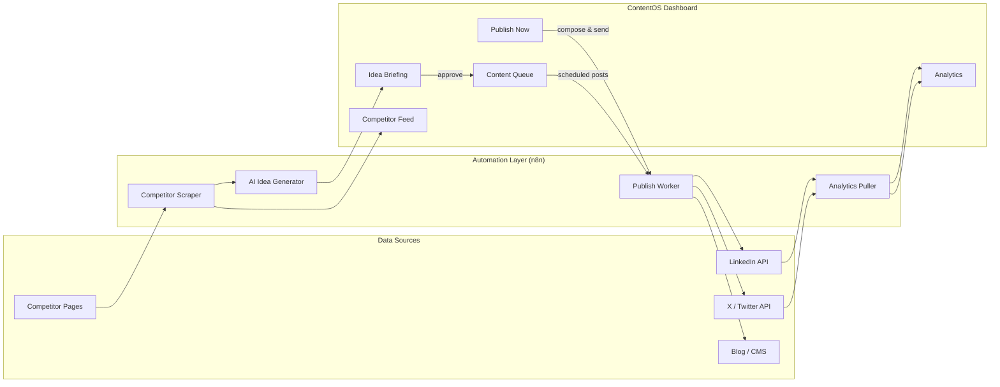
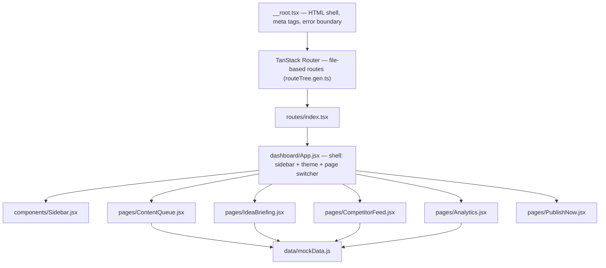

# ContentOS — SaaS Content Dashboard

**Plan, approve, schedule and analyze SaaS content across LinkedIn, X (Twitter) and your blog — from a single dashboard.**

🔗 **Live Demo:** [mycontentos.netlify.app](https://mycontentos.netlify.app/)

---

## 📖 Overview

ContentOS is a content operations dashboard built for SaaS marketing teams who publish across multiple channels and need one place to manage the entire pipeline — from AI-generated idea to published post to performance report.

Instead of juggling a content calendar, three social schedulers, and a separate analytics tab, ContentOS brings five workflows into a single pane of glass:

| Module | What it does |
|---|---|
| **Idea Briefing** | Surfaces AI-generated content ideas each day, scored by potential (High/Medium) and tagged with the signal that generated them — competitor gap, audience question, SEO gap, niche trend, or your own top-performing post. |
| **Content Queue** | A pipeline view for drafts, approvals, scheduled posts, and published content across LinkedIn, X, and your blog. |
| **Publish Now** | Compose and ship a post on the spot — pick a platform, generate a draft, and publish immediately. |
| **Competitor Feed** | Tracks competitor posts, sortable by engagement or likes, so you always know what's working in your niche. |
| **Analytics** | Impressions, engagement rate, follower growth, and link clicks, broken down by platform and by top-performing post. |

The dashboard is designed to sit on top of an **automation layer** (built in n8n) that does the actual work in the background: scraping competitor content, generating ideas with an LLM, pulling analytics from platform APIs, and pushing approved posts live. ContentOS itself is the control surface — the human-in-the-loop layer where content gets reviewed, approved, and tracked.

---

## 🏗️ Architecture

### System overview



### Frontend architecture



The app is a **TanStack Start** (React 19 + TanStack Router) SSR application. A single route (`/`) mounts the dashboard SPA shell (`dashboard/App.jsx`), which handles its own internal page-switching, theme (light/dark, persisted to `localStorage`), and responsive mobile navigation — independent of the router.

---

## 🛠️ Tech Stack

**Framework & Routing**
- [TanStack Start](https://tanstack.com/start) (React 19) — full-stack React framework with SSR
- [TanStack Router](https://tanstack.com/router) — type-safe, file-based routing
- [TanStack Query](https://tanstack.com/query) — data fetching & caching

**UI**
- [shadcn/ui](https://ui.shadcn.com/) + [Radix UI](https://www.radix-ui.com/) primitives
- [Tailwind CSS v4](https://tailwindcss.com/)
- [Recharts](https://recharts.org/) — analytics charts
- [Lucide React](https://lucide.dev/) — icons
- [Sonner](https://sonner.emilkowal.ski/) — toasts

**Forms & Utilities**
- React Hook Form + Zod — form state & validation
- date-fns — date handling
- clsx / tailwind-merge / class-variance-authority — styling utilities

**Automation Layer** *(external, not in this repo)*
- [n8n](https://n8n.io/) — competitor scraping, AI idea generation, analytics pulls, and multi-platform publishing

**Build & Tooling**
- Vite 7 · TypeScript · ESLint · Prettier · Bun (package manager)

**Hosting**
- [Netlify](https://www.netlify.com/)

---

## 📂 Project Structure

```
ContentOS-main/
├── public/
│   └── ContentOsLogo.png
├── src/
│   ├── components/ui/          # shadcn/ui component library
│   ├── dashboard/
│   │   ├── App.jsx             # dashboard shell (sidebar, theme, page switching)
│   │   ├── components/
│   │   │   └── Sidebar.jsx
│   │   ├── data/
│   │   │   └── mockData.js     # sample data for all modules
│   │   └── pages/
│   │       ├── ContentQueue.jsx
│   │       ├── IdeaBriefing.jsx
│   │       ├── CompetitorFeed.jsx
│   │       ├── Analytics.jsx
│   │       └── PublishNow.jsx
│   ├── routes/
│   │   ├── __root.tsx          # HTML shell, meta tags, error boundary
│   │   └── index.tsx           # mounts the dashboard at "/"
│   ├── lib/                    # error reporting, shared utils, API stubs
│   ├── router.tsx
│   └── server.ts
├── vite.config.ts
├── package.json
└── README.md
```

---

## 🚀 Getting Started

**Prerequisites:** [Bun](https://bun.sh/) (or Node.js + your package manager of choice)

```bash
# Install dependencies
bun install

# Start the dev server
bun run dev

# Build for production
bun run build

# Preview the production build locally
bun run preview
```

The dev server runs at `http://localhost:3000` by default.

---

## 📦 Deployment

This project is deployed on **Netlify** with continuous deployment from the `main` branch on GitHub.

Live: **https://mycontentos.netlify.app/**

---

## 👤 Author

Built by **Fhiroj Shaik** — Founder, MOFI AI. I build AI agents, voice AI systems, and n8n-powered automation for real businesses.

🔗 **LinkedIn:** [linkedin.com/in/fhiroj-shaik-020760355](https://www.linkedin.com/in/fhiroj-shaik-020760355/)
